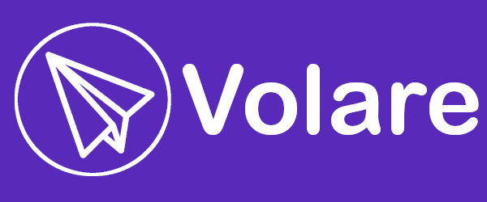

<p align="center">
  
</p>

# Volare Consulting

> Your ideas taking flight.

Volare is the engineering team you bring on when the team you have can't get to it. Engagements are scoped to ship, not to bill — we commit to outcomes, not hours.

## How we build software

A handful of repos here do most of the work. Three of them define how Volare ships; one defines how Volare sounds.

### `volare-brand` — how Volare presents itself

The single source of truth for colors, typography, components, voice, naming, and logo. Every Volare-built artifact — proposals, marketing, product UI, customer email — draws from it. One brand, two registers (external and internal), same personality.

### `pilota` — the SDLC engine

Pilota drives a software project end-to-end with a coordinated team of specialist AI agents and a human in the loop at the gates that matter: requirements → PRD → design → walking skeleton → vertical slices → tests → review → merge. Language-agnostic and integration-agnostic — works whether you're shipping TypeScript on Vercel through GitHub Actions with Linear tickets, or C# on Azure through Azure Pipelines with Jira.

### `volare-pilota-pack` — Volare's house style for Pilota

Pilota stays generic. `volare-pilota-pack` is the opinionated overlay for Volare-internal engagements — coding conventions, delivery patterns for the AZDO and GitHub stacks, and per-product context. Drops into `~/.pilota/` so any Pilota engagement on Volare work picks up Volare standards automatically. Other Pilota consumers ship their own packs.

### `vito.ai` — Volare's AI agent

Vito is the voice of Volare for chatbots, agentic workflows, and customer-facing surfaces. He inherits brand voice from `volare-brand` and adds character on top — same foundation as a human Volare writer, different surface.

## How they fit together

```
                    volare-brand
                  (voice + visual)
                  ─────────┬──────────
                           │
                           ├──→  vito.ai
                           │     (talks to customers)
                           │
                           └──→  pilota engagements
                                 ⬑ volare-pilota-pack
                                 (builds software with Volare standards)
```

Pilota is the engine. `volare-pilota-pack` is Volare's configuration of it. Vito is the voice. `volare-brand` is the throughline — it's what makes a Volare proposal, a Pilota-built feature, and a Vito reply all sound recognizably like Volare.
